# DataStructuresAndAlgorithm
数据结构与算法的一些实例，数据结构包括图（遍历算法）、树（哈夫曼树、AVL平衡树等），算法包括查找算法（二分查找、斐波那契查找等）、排序算法（快速排序、堆排序等）、贪心算法、KMP算法等。


# 1、数据结构
## 1) 栈
### 计算器

##### - 代码实现

[计算器(Calculator.java)](./src/main/java/com/tzuxin/datastructures/stack/Calculator.java)


### 中序表达式转后序表达式

##### - 代码实现

[中序表达式转后序表达式 (PolandNotation.java)](./src/main/java/com/tzuxin/datastructures/stack/PolandNotation.java)


## 2) 队列
### 循环队列

##### - 代码实现

[循环队列 (CircleArrayList.java)

[](./src/main/java/com/tzuxin/datastructures/queue/CircleArrayList.java)

## 3) 递归


### 迷宫回溯问题

##### - 代码实现

[迷宫回溯问题(Maze.java)](./src/main/java/com/tzuxin/datastructures/recurrence/Maze.java)


### 八皇后问题

##### - 代码实现

[八皇后问题(Queen8.java)](./src/main/java/com/tzuxin/datastructures/recurrence/Queen8.java)


## 4) 哈希表(Hash Table)

#### - 代码实现

**[HashTableDemo.java](./src/main/java/com/tzuxin/datastructures/recurrence/HashTableDemo.java)**


## 5) 树


### 5.1 二叉树

#### 介绍

#### 树的常用术语

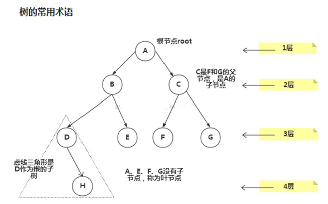

树的常用术语(结合示意图理解):

1) 节点

2) 根节点
3) 父节点
4) 子节点
5) 叶子节点 (没有子节点的节点)
6) 节点的权(节点值)
7) 路径(从root节点找到该节点的路线) 8) 层
8) 子树
9) 树的高度(最大层数)
10) 森林 :多颗子树构成森林


#### 树的遍历

使用前序，中序和后序对下面的二叉树进行遍历.

1) **前序遍历**: 先输出父节点，再遍历左子树和右子树
2) **中序遍历**: 先遍历左子树，再输出父节点，再遍历右子树

3) **后序遍历**: 先遍历左子树，再遍历右子树，最后输出父节点

**小结:** 看输出父节点的顺序，就确定是前序，中序还是后序


#### - 代码实现

[二叉树(Binary Tree)](./src/main/java/com/tzuxin/datastructures/tree/BinaryTreeDemo.java)


### 5.2 顺序存储二叉树


#### 介绍

从数据存储来看，数组存储方式和树的存储方式可以相互转换，即**数组可以转换成树，树也可以转换成数组**。

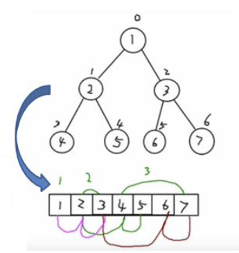

#### 顺序存储二叉树的特点:

1. 顺序二叉树通常只考虑完全二叉树
2. 第n个元素的左子节点为 2 * n + 1
3. 第n个元素的右子节点为 2 * n + 2
4. 第 n 个元素的父节点为 (n-1) / 2
5. n : 表示二叉树中的第几个元素(按 0 开始编号如图所示)


#### - 代码实现

[顺序存储二叉树(Array Binary Tree)](./src/main/java/com/tzuxin/datastructures/tree/ArrayBinaryTreeDemo.java)


### 5.3 线索二叉树

#### 线索二叉树的特点

1. n 个结点的二叉链表中含有 n+1 【公式 2n-(n-1)=n+1】 个空指针域。利用二叉链表中的空指针域，存放指向

   该结点在某种遍历次序下的前驱和后继结点的指针(这种附加的指针称为"线索")

2. 这种加上了线索的二叉链表称为线索链表，相应的二叉树称为线索二叉树(ThreadedBinaryTree)。根据线索性质的不同，线索二叉树可分为前序线索二叉树、中序线索二叉树和后序线索二叉树三种

3. 一个结点的前一个结点，称为前驱结点

4. 一个结点的后一个结点，称为后继结点


#### 应用案例


##### - 代码实现

[线索二叉树(Threaded Binary Tree)](./src/main/java/com/tzuxin/datastructures/tree/threadedbinarytree/ThreadedBinaryTreeDemo.java)


### 5.4 哈夫曼树

#### 介绍

1) 给定n个权值作为n个叶子结点，构造一棵二叉树，若该树的带权路径长度**(wpl)**达到最小，称这样的二叉树为 最优二叉树，也称为哈夫曼树(Huffman Tree), 还有的书翻译为霍夫曼树。
2) 赫夫曼树是带权路径长度最短的树，权值较大的结点离根较近


#### 重要概念

1) **路径和路径长度**：在一棵树中，从一个结点往下可以达到的孩子或孙子结点之间的通路，称为路径。**通路中分支的数目称为路径长度**。若规定根结点的层数为 1，则从根结点到第 L 层结点的路径长度为 L-1
2) **结点的权及带权路径长度**：若将树中结点赋给一个有着某种含义的数值，则这个数值称为该结点的权。**结点的带权路径长度为**：从根结点到该结点之间的路径长度与该结点的权的乘积
3) **树的带权路径长度**：树的带权路径长度规定为**所有叶子结点的带权路径长度之和**，记为 WPL(weighted path length) ,权值越大的结点离根结点越近的二叉树才是最优二叉树。


#### - 代码实现

[哈夫曼树(Huffman Tree)](./src/main/java/com/tzuxin/datastructures/tree/huffmantree/HuffmanTree.java)


### 5.5 数据压缩(哈夫曼编码)

#### 介绍

1) 赫夫曼编码也翻译为 **哈夫曼编码(Huffman Coding)**，又称霍夫曼编码，是一种编码方式, 属于一种程序算法 
2) 赫夫曼编码是赫哈夫曼树在电讯通信中的经典的应用之一。
3) 赫夫曼编码广泛地用于数据文件压缩。其压缩率通常在20%~90%之间
4) 赫夫曼码是可变字长编码(VLC)的一种。Huffman于1952年提出一种编码方法，称之为最佳编码


#### 原理


#### 应用案例-数据压缩(创建赫夫曼树)

将给出的一段文本，比如 "i like like like java do you like a java" ， 根据前面的讲的赫夫曼编码原理，对其进行数 据压缩处理 ，形式如"10101001101111011110100110..."


##### 思路

1) 生成赫夫曼树对应的赫夫曼编码 , 如: a=100 d=11000 u=11001 e=1110 v=11011 i=101 y=11010 j=0010 k=1111 l=000 o=0011

2) 使用赫夫曼编码来生成赫夫曼编码数据 ,即按照上面的赫夫曼编码，将"i like like like java do you like a java" 字符串生成对应的编码数据, 形式如下. 101010001011111111001000101111111100100010111111110010010100110111....


##### - 代码实现

[数据压缩(哈夫曼编码 Huffman Code)](./src/main/java/com/tzuxin/datastructures/tree/huffmancode/HuffmanCode.java)


### 5.6 二叉排序树

#### 介绍

**BST: (Binary Sort(Search) Tree)**, 对于二叉排序树的任何一个非叶子节点，要求左子节点的值比当 前节点的值小，右子节点的值比当前节点的值大。

**特别说明：**如果有相同的值，可以将该节点放在左子节点或右子节点 


比如 (7, 3, 10, 12, 5, 1, 9) ，对应的二叉排序树为:

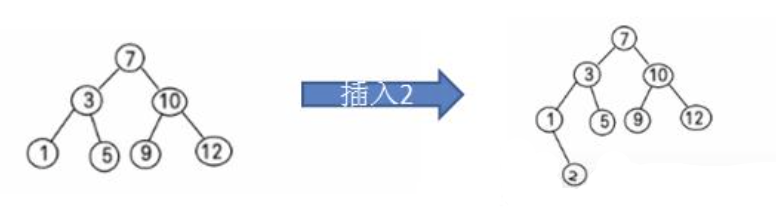


#### - 代码实现

[二叉排序树(Binary Sort Tree)](./src/main/java/com/tzuxin/datastructures/tree/binarysorttree/BinarySortTree.java)


### 5.7 平衡二叉树


#### 介绍

1) 平衡二叉树也叫**平衡二叉搜索树(Self-balancingbinarysearchtree)**又被称为AVL树，可以保证查询效率较高。
2) 有以下特点:它是一棵空树或它的左右两个子树的高度差的绝对值不超过**1**，并且左右两个子树都是一棵
3) 平衡二叉树。平衡二叉树的常用实现方法有红黑树、AVL、替罪羊树、Treap、伸展树等。


#### 左旋转

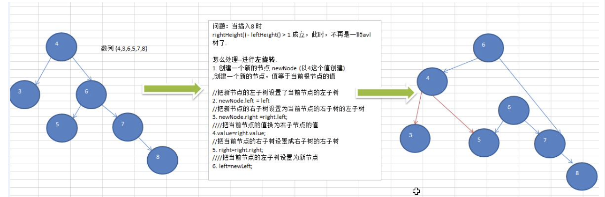


#### 右旋转

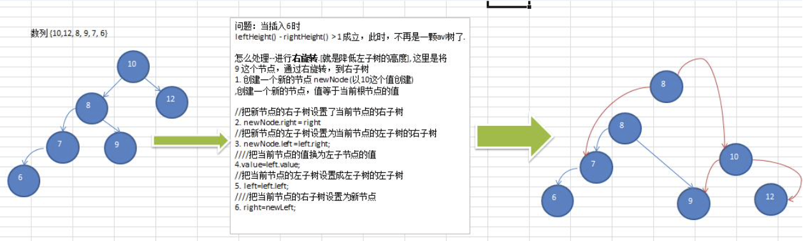


#### 双旋转

前面的两个数列，进行单旋转(即一次旋转)就可以将非平衡二叉树转成平衡二叉树,但是在某些情况下，单旋转 不能完成平衡二叉树的转换。


#### - 代码实现

[平衡二叉树(AVL Tree)](./src/main/java/com/tzuxin/datastructures/tree/avl/AVLTree.java)


## 6) 多路查找树


### 6.1 二叉树与B树

#### 1、二叉树的问题分析

二叉树的**操作效率较高**，但是也存在问题, 请看下面的二叉树

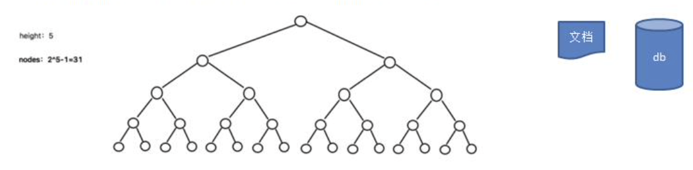

二叉树需要加载到内存的，如果二叉树的节点少，没有什么问题，但是如果二叉树的**节点很多**，就存在如下问题:

**问题1:** 在构建二叉树时，需要多次进行i/o操作(海量数据存在数据库或文件中)，节点海量，构建二叉树时，**速度有影响**。

**问题2:** 节点海量，也会造成二叉树的高度很大，会**降低操作速度**。


#### 2、多叉树

1. 在二叉树中，每个节点有数据项，最多有两个子节点。如果允许每个节点可以有更多的数据项和更多的子节点，就是多叉树(multiway tree)
2. **2-3树**，**2-3-4树**就是多叉树，多叉树通过重新组织节点，**减少树的高度**，能对二叉树进行优化。
3. 举例说明(下面2-3树就是一颗多叉树)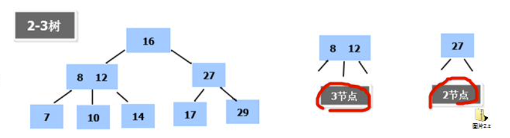


#### 3、B树的基本介绍

B 树通过重新组织节点，降低树的高度，并且减少 i/o 读写次数来提升效率。

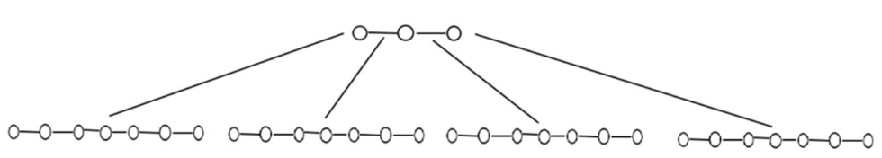

1. 如图B树通过**重新组织节点，降低了树的高度**；

2. 文件系统及数据库系统的设计者利用了磁盘预读原理，将**一个节点的大小设为等于一个页**(页得大小通常为4k)，

   这样每个节点只需要一次 I/O 就可以完全载入；

3. 将树的度M设置为1024，在600亿个元素中最多只需要4次I/O操作就可以读取到想要的元素，B树(B+)广泛应用于**文件存储系统以及数据库系统中**。


### 6.2  2-3树

#### 1、2-3树是最简单的 B 树结构

1) 2-3 树的**所有叶子节点都在同一层**.(只要是 B 树都满足这个条件)；
2) 有两个子节点的节点叫**二节点**，二节点要么没有子节点，要么有两个子节点；

3) 有三个子节点的节点叫**三节点**，三节点要么没有子节点，要么有三个子节点. 
4) 2-3 树是**由二节点和三节点构成的树**。


#### 2、2-3树应用案例

将数列{16, 24, 12, 32, 14, 26, 34, 10, 8, 28, 38, 20} 构建成 2-3 树，并保证数据插入的大小顺序。

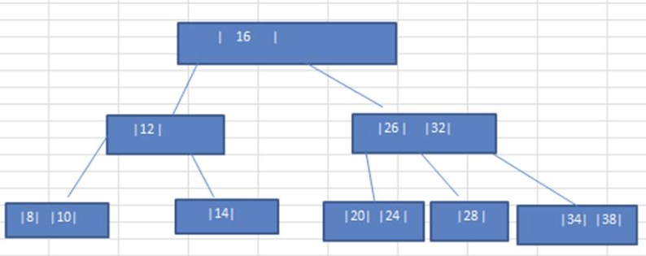


插入规则:

1. 2-3 树的所有叶子节点都在同一层.(只要是 B 树都满足这个条件)；
2. 有两个子节点的节点叫二节点，二节点要么没有子节点，要么有两个子节点；
3. 有三个子节点的节点叫三节点，三节点要么没有子节点，要么有三个子节点；
4. 当按照规则插入一个数到某个节点时，不能满足上面三个要求，**就需要拆，先向上拆，如果上层满，则拆本层**；

5) 对于三节点的子树的值大小仍然遵守(BST 二叉排序树)的规则。


#### 3、其他说明

除了 23 树，还有 234 树等，概念和 23 树类似，也是一种 B 树。 如图:

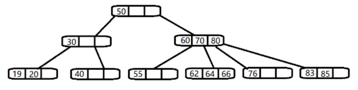


### 6.3 B树、B+树和B*树


#### 1、B树的介绍

前面已经介绍了 2-3 树和 2-3-4 树，他们就是 B 树(英语:B-tree 也写成 B-树)， Mysql 的索引是基于 B 树或者 B+树的，如图:

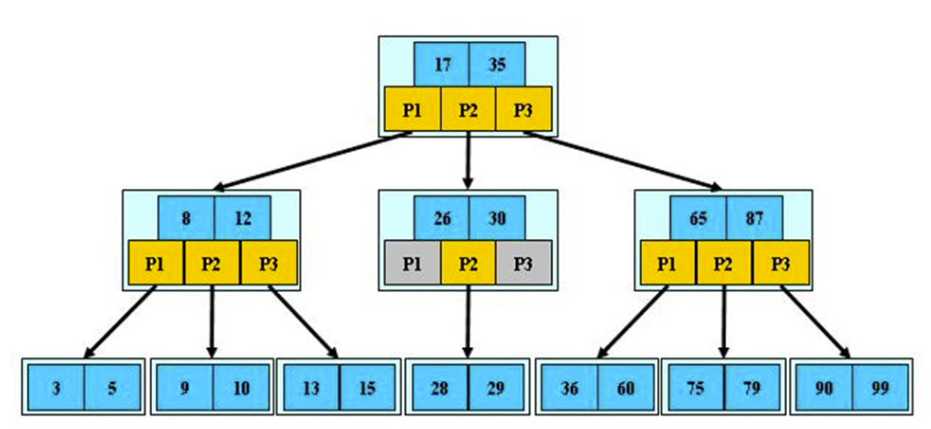

对上图的说明:

1) B树的阶：节点的最多子节点个数。比如 2-3 树的阶是 3，2-3-4 树的阶是 4；
2) B树的搜索，从根结点开始，对结点内的关键字(有序)序列进行二分查找，如果命中则结束，否则进入查询关键字所属范围的儿子结点；重复，直到所对应的儿子指针为空，或已经是叶子结点；
3) 关键字集合分布在整颗树中, 即叶子节点和非叶子节点都存放数据；
4) 搜索有可能在非叶子结点结束；
5) 其搜索性能等价于在关键字全集内做一次二分查找。


#### 2、B+树

B+树是 B 树的变体，也是一种多路搜索树。

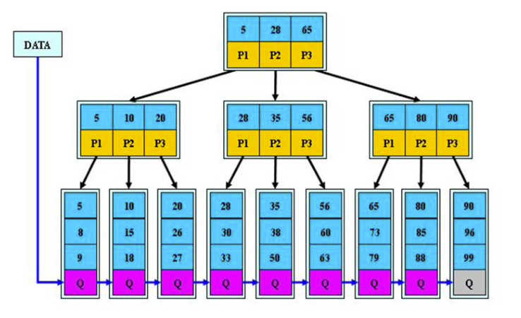

对上图的说明:

1. B+树的搜索与 B 树也基本相同，区别是 B+树只有达到叶子结点才命中(B 树可以在非叶子结点命中)，其性能也等价于在关键字全集做一次二分查找

2. 所有关键字都出现在叶子结点的链表中（即数据只能在叶子节点【也叫稠密索引】），且链表中的关键字(数据)

   恰好是有序的。

3. 不可能在非叶子结点命中

4. 非叶子结点相当于是叶子结点的索引(稀疏索引)，叶子结点相当于是存储(关键字)数据的数据层

5. 更适合文件索引系统

6. B 树和 B+树各有自己的应用场景，不能说 B+树完全比 B 树好，反之亦然.


#### 3、B*树

B*树是 B+树的变体，在 B+树的非根和非叶子结点再增加指向兄弟的指针。

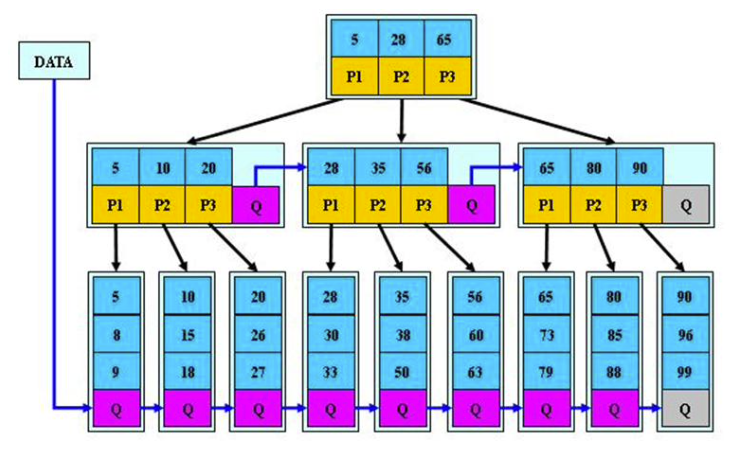

**B*树的说明:**

1) B*树定义了非叶子结点关键字个数至少为(2/3)*M，即块的最低使用率为 2/3，而 B+树的块的最低使用率为的1/2。

2) 从第1个特点我们可以看出，B*树分配新结点的概率比B+树要低，**空间使用率更高**


## 7) 图


### 图的遍历

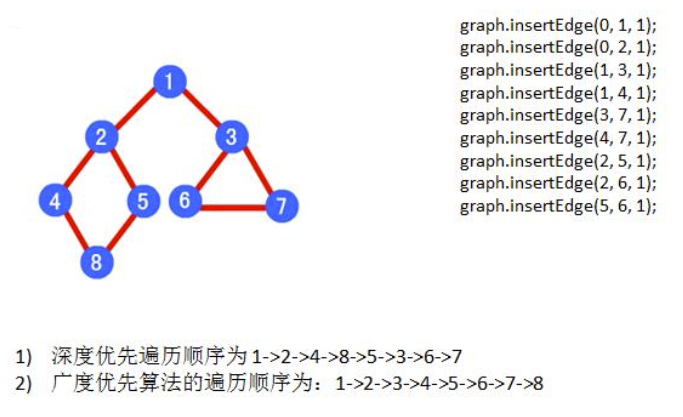


#### 广度优先遍历

```java
/**
 * 对一个节点进行广度优先遍历
 * @param isVisited 是否被访问过的byte[]
 * @param i 下标
 */
private void bfs(boolean[] isVisited, int i){
    int u;  // 队列头节点的下标
    int w;  // 邻接节点
    // 队列
    LinkedList<Integer> queue = new LinkedList<>();
    // 输出当前节点
    System.out.print("=>" + getVertex(i));
    // 标记为已访问
    isVisited[i] = true;
    // 把节点加入队列
    queue.addLast(i);
    // 队列非空就一直运行
    while (!queue.isEmpty()){
        u = queue.removeFirst();
        // 找到u的第一个邻接点
        w = getFirstNeighbor(u);
        while (w != -1){
            if (!isVisited[w]){
                // 输出这个节点
                System.out.print("=>" + getVertex(w));
                // w入队
                queue.addLast(w);
                // 标记为已访问
                isVisited[w] = true;
            }
            // 找u在w之后的节点
            w = getNextNeighbor(u, w);
        }
    }
}
```


#### 深度优先遍历

```java
/**
 * 深度优先遍历
 * @param isVisited 是否被访问过的byte[]
 * @param i 下标
 */
private void dfs(boolean[] isVisited, int i){
    // 先输出当前节点
    System.out.print("=>" + getVertex(i));
    isVisited[i] = true;
    // 找到第一个邻接节点
    int w = getFirstNeighbor(i);
    while (w != -1){
        // 如果这个邻接节点没被访问过，就让他进行遍历
        if (!isVisited[w]){
            dfs(isVisited, w);
        }
        // 让w指向i的下一个邻接节点
        w = getNextNeighbor(i, w);
    }
}
```


#### - 代码实现

[图(Graph)](./src/main/java/com/tzuxin/datastructures/graph/Graph.java)


# 2、排序算法

> [排序算法演示：VisuAlgo](https://visualgo.net/en/sorting)


## 1） 插入排序
###  2.1.1 简单插入排序

> 时间复杂度：O(n^2)
>
> 稳定性：不稳定


#### - 算法介绍

插入排序(Insertion Sorting)的基本思想是:**把 n 个待排序的元素看成为一个有序表和一个无序表**，开始时**有序表中只包含一个元素**，无序表中包含有 **n-1 个元素**，排序过程中每次从无序表中取出第一个元素，把它的排 序码依次与有序表元素的排序码进行比较，将它插入到有序表中的适当位置，使之成为新的有序表。

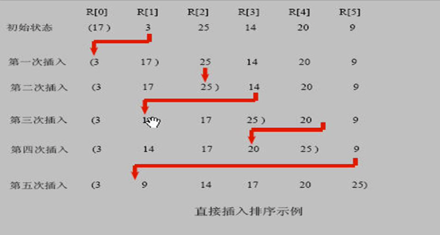

#### - 代码实现

[InsertionSort](src/main/java/com/tzuxin/datastructures/sort/InsertionSort.java)

```java
/**
 * 插入排序
 * @param arr 待排序数组
 */
public static void insertionSort(int[] arr) {
    for (int i = 1; i < arr.length; i++) {
        int key = arr[i];
        int j = i - 1;
        while (j >= 0 && arr[j] > key) {
            arr[j + 1] = arr[j];
            j--;
        }
        arr[j + 1] = key;
    }
}
```


### 2.1.2 希尔排序

> 时间复杂度：O(n^1.3)
>
> 稳定性：不稳定

#### - 算法介绍

希尔排序是希尔(Donald Shell)于 1959 年提出的一种排序算法。希尔排序也是一种**插入排序**，它是简单插入排序经过改进之后的一个更高效的版本，也称为**缩小增量排序**。

##### 简单插入排序存在的问题

我们看简单的插入排序可能存在的问题.
 数组 arr = {2,3,4,5,6,1} 这时需要插入的数**1(最小)**, 这样的过程是: {2,3,4,5,6,6}
 {2,3,4,5,5,6}
 {2,3,4,4,5,6}
 {2,3,3,4,5,6}
 {2,2,3,4,5,6}
 {1,2,3,4,5,6}
 结论**:** **当需要插入的数是较小的数时，后移的次数明显增多，对效率有影响**


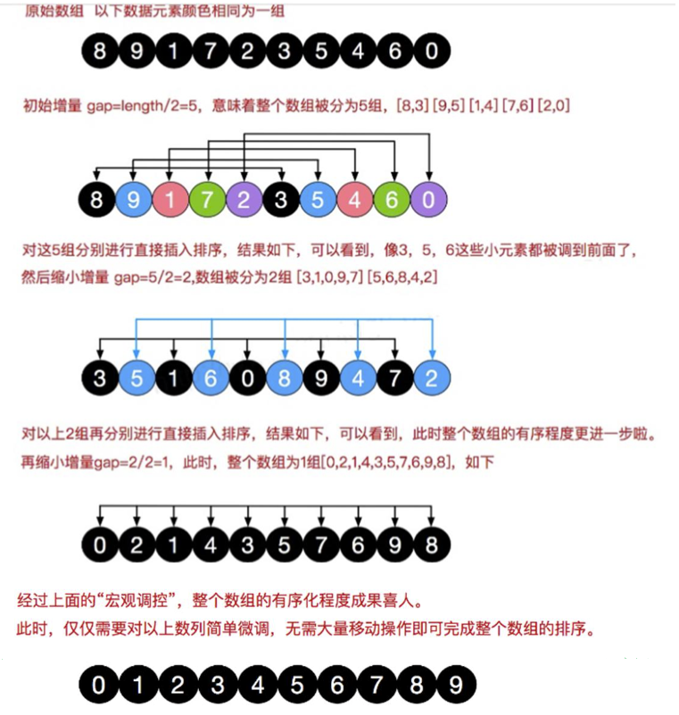


#### - 代码实现

[希尔排序(Shell Sort)](./src/main/java/com/tzuxin/datastructures/sort/ShellSort.java)

```java
/**
 * 希尔排序
 * @param arr 待排序数组
 */
public static void shellSort(int[] arr) {
    int len = arr.length;
    // 根据步长先排序一轮
    int temp, gap = len / 2;
    while (gap > 0) {
        for (int i = gap; i < len; i++) {
            temp = arr[i];
            int preIndex = i - gap;
            while (preIndex >= 0 && arr[preIndex] > temp) {
                arr[preIndex + gap] = arr[preIndex];
                preIndex -= gap;
            }
            arr[preIndex + gap] = temp;
        }
        gap /= 2;
    }
}
```


## 2） 选择排序


### 2.2.1 简单选择排序

#### - 算法介绍

选择排序(select sorting)也是一种简单的排序方法。它的基本思想是:第一次从 arr[0]~arr[n-1]中选取最小值，与 arr[0]交换，第二次从 arr[1]~arr[n-1]中选取最小值，与 arr[1]交换，第三次从 arr[2]~arr[n-1]中选取最小值，与 arr[2] 交换，...，第 i 次从 arr[i-1]~arr[n-1]中选取最小值，与 arr[i-1]交换，..., 第 n-1 次从 arr[n-2]~arr[n-1]中选取最小值， 与 arr[n-2]交换，总共通过 n-1 次，得到一个按排序码从小到大排列的有序序列。

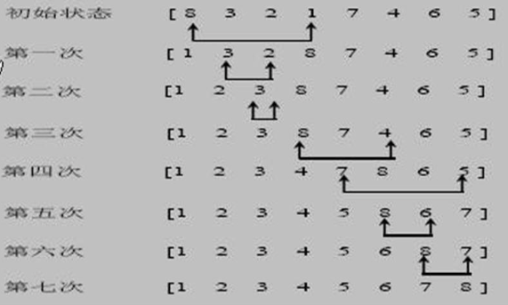


#### - 代码实现

[简单选择排序(Select Sort)](./src/main/java/com/tzuxin/datastructures/sort/SelectSort.java)

```java
/**
 * 选择排序
 * @param arr 数组
 */
public static void selectSort(int[] arr){
    int index;
    int min;
    for (int i = 0; i < arr.length; i++) {
        // 记录最小的数
        min = arr[i];
        // 用于记录最小数的下标
        index = -1;
        for (int j = i+1; j < arr.length; j++) {
            // 找到更小的数，先进行标记
            if (arr[j] < min){
                index = j;
                min = arr[j];
            }
        }
        // 如果有找到更小的数就进行交换
        if (index != -1){
            // 交换位置
            int temp = arr[i];
            arr[i] = min;
            arr[index] = temp;
        }
    }
}
```


### 2.2.2 堆排序(Heap Sort)
> 时间复杂度：O(nlog2n) 
>
> 稳定性：不稳定
>


#### - 算法介绍

1. 堆排序是利用堆这种数据结构而设计的一种排序算法，堆排序是一种选择排序，它的最坏，最好，平均时间复 杂度均为 **O(nlogn)**，它也是不稳定排序。
2. 堆是具有以下性质的完全二叉树:每个结点的值都大于或等于其左右孩子结点的值，称为大顶堆, 注意 : 没有要求结点的左孩子的值和右孩子的值的大小关系。
3. 每个结点的值都小于或等于其左右孩子结点的值，称为小顶堆
4. 一般升序采用大顶堆，降序采用小顶堆


##### 堆排序的基本思想是:

1. 将待排序序列构造成一个大顶堆
2. 此时，整个序列的最大值就是堆顶的根节点。
3. 将其与末尾元素进行交换，此时末尾就为最大值。
4. 然后将剩余n-1个元素重新构造成一个堆，这样会得到n个元素的次小值。如此反复执行，便能得到一个有序序列了。


#### - 代码实现

[堆排序(Heap Sort)](./src/main/java/com/tzuxin/datastructures/sort/HeapSort)

```java

/**
 * 升序排序
 *
 * @param arr 要排序的数组
 */
public static void heapSort(int[] arr) {
    int temp = 0;
    // 先进行第一次调整，确保是大顶堆
    for (int i = arr.length / 2 - 1; i >= 0; i--) {
        adjustHeap(arr, i, arr.length);
    }
    for (int j = arr.length-1; j > 0; j--) {
        // 把顶上的最大元素调整到最后一个叶子节点上，且不再移动
        temp = arr[j] ;
        arr[j] = arr[0];
        arr[0] = temp;
        adjustHeap(arr, 0, j);
    }
}

/**
 * 把数组(二叉树)调整为大顶堆
 * @param arr 要调整的数组
 * @param i   非叶子节点的下标
 * @param len 要调整多少个元素(len会逐渐减少)
 */
public static void adjustHeap(int[] arr, int i, int len) {
    int temp = arr[i];
    // 从i指向的节点往下遍历，把大的树移动到上面
    for (int j = i * 2 + 1; j < len; j = j * 2 + 1) {
        // 指向左右子树中大的元素
        if (j + 1 < len && arr[j] < arr[j + 1]) {
            j++;
        }
        // 如果左/右子树的值大于i指向的元素，则进行交换。
        if (arr[j] > temp) {
            arr[i] = arr[j];
            // 交换下标位置，让i指向下面的树
            i = j;
        } else {
            // 如果小于，代表后面的节点已经排序好了，退出
            break;
        }
    }
    // 最后再把temp保存的值替换到最后交换的元素上
    arr[i] = temp;
}
```


## 3）交换排序
### 2.3.1 冒泡排序
> 时间复杂度：O(n^2)
>
> 稳定性：稳定


##### 算法介绍

冒泡排序(Bubble Sorting)的基本思想是：通过对待排序序列从前向后(从下标较小的元素开始)，**依次比较相邻元素的值，若发现逆序则交换，使值较大的元素逐渐从前移向后部**，就象水底下的气泡一样逐渐向上冒。


##### 代码实现

##### [冒泡排序(Bubble Sorting)](./src/main/java/com/tzuxin/datastructures/sort/BubbleSort.java)

```java
/**
 * 冒泡排序
 * @param arr 数组
 */
public static void bubbleSort(int[] arr){
    boolean flag = true;
    for (int i = 0; i < arr.length - 1; i++) {
        for (int j = 0; j < arr.length - i - 1; j++) {
            if (arr[j] > arr[j+1]){
                // 交换
                int temp = arr[j];
                arr[j] = arr[j + 1];
                arr[j + 1] = temp;
                flag = false;
            }
        }
        if (flag){
            System.out.println("输入的数组已为排序好的数组");
            return;
        }
    }
}
```


### 2.3.2 快速排序
> 时间复杂度：O(nlog2n)
>
> 稳定性：不稳定

##### 算法介绍

快速排序(Quicksort)是对**冒泡排序**的一种改进。基本思想是:通过一趟排序将要排序的数据分割成独立的两 部分，其中一部分的所有数据都比另外一部分的所有数据都要小，然后再按此方法对这两部分数据分别进行快速排 序，**整个排序过程可以递归进行**，以此达到整个数据变成有序序列	


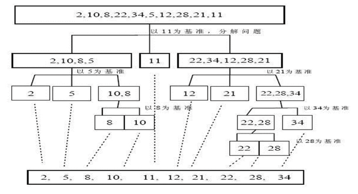

##### 代码实现

##### [快速排序(Quick Sort)](./src/main/java/com/tzuxin/datastructures/sort/QuickSort.java)

```java
/**
     * 快速排序实现
     * @param arr 待排序数组
     * @param low 数组左侧下标
     * @param high 右侧下标
     */
    public static void quickSort(int[] arr, int low, int high){
        if (low < high){
            // 指向交换后的中心点坐标
            int pointer = low;
            // 当前对比的元素，小的在左，大的在右
            int pivot = arr[high];
            // 循环当前数组段
            for (int i = low; i < high; i++) {
                // 大于中心的往右放
                if (arr[i] <= pivot){
                    int temp = arr[i];
                    arr[i] = arr[pointer];
                    arr[pointer] = temp;
                    pointer++;
                }
            }
            // 把基准数放到中心
            arr[high] = arr[pointer];
            arr[pointer] = pivot;
            // 递归
            quickSort(arr, low, pointer - 1);
            quickSort(arr, pointer + 1, high);

        }
    }
```


## 4）归并排序

### 2.4.1 归并排序

> 时间复杂度：O(nlog2n)
>
> 稳定性：稳定


#### -算法介绍

归并排序(MERGE-SORT)是利用归并的思想实现的排序方法，该算法采用经典的**分治(divide-and-conquer) 策略**(分治法将问题分(divide)成一些**小的问题然后递归求解**，而治(conquer)的阶段则将分的阶段得到的各答案"修补"在一起，即分而治之)。

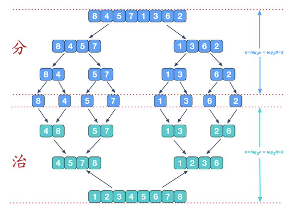


#### -代码实现

[归并排序(Merge Sort)](./src/main/java/com/tzuxin/datastructures/sort/MergeSort.java)

```java
/**
 * 归并排序
 * @param arr 待排序数组
 * @param left 左侧下标
 * @param right 右侧下标
 * @param temp 临时变量数组
 */
public static void mergeSort(int[] arr, int left, int right, int[] temp){
    if (left < right){
        int mid = (left + right) / 2;
        // 左侧递归传入
        mergeSort(arr, left, mid, temp);
        // 右侧递归传入
        mergeSort(arr, mid + 1, right, temp);
        // 排序
        merge(arr, left, right, mid, temp);
    }
}

/**
 * 
 * @param arr 待排序数组
 * @param left 左侧下标
 * @param right 右侧下标
 * @param mid 中间节点下标
 * @param temp 临时变量
 */
public static void merge(int[] arr, int left, int right, int mid, int[] temp) {
    int i = left;
    int j = mid + 1;
    int index = 0;
    while (i <= mid || j <= right) {
        if (j > right || (i <= mid && arr[i] <= arr[j]) ) {
            temp[index++] = arr[i++];
        } else {
            temp[index++] = arr[j++];
        }
    }

    // 拷贝到原来的数组里
    index  = 0;
    int tempLeft = left;
    while (tempLeft <= right){
        arr[tempLeft] = temp[index];
        tempLeft++;
        index++;
    }
}
```


## 5）基数排序
### 2.5.1 基数排序

> 时间复杂度：O(n*k)
>
> 稳定性：稳定


#### - 算法介绍

将所有待比较数值统一为同样的数位长度，数位较短的数前面补零。然后，从最低位开始，依次进行一次排序。这样从最低位排序一直到最高位排序完成以后, 数列就变成一个有序序列。


#### - 代码实现

[基数排序(Radix Sort)](./src/main/java/com/tzuxin/datastructures/sort/RadixSort.java)

```java
/**
 * 基数排序
 * @param arr 待排序数组
 */
public static void radixSort(int[] arr) {
    // 拿到最大的位数
    int max = arr[0];
    for (int i = 1; i < arr.length; i++) {
        if (max < arr[i]) {
            max = arr[i];
        }
    }
    int maxSize = (max + "").length();

    // 桶
    int[][] bucket = new int[10][arr.length];
    // 记录bucket数组里存放的元素个数
    int[] bucketSize = new int[10];

    for (int k = 0; k < maxSize; k++) {
        for (int i = 0; i < arr.length; i++) {
            // 每次循环取不同的位
            int digit = arr[i] / (int)Math.pow(10,k) % 10;
            // 存放到对应桶的数组中，++的是元素的有效个数
            bucket[digit][bucketSize[digit]++] = arr[i];
        }
        int index = 0;
        // 把数据从桶取回数组
        for (int i = 0; i < bucketSize.length; i++) {
            if (bucketSize[i] != 0) {
                for (int j = 0; j < bucketSize[i]; j++) {
                    arr[index++] = bucket[i][j];
                }
            }
            bucketSize[i] = 0;
        }
    }
}
```


# 3、查找算法
### 3.1 二分查找(Binary Search)

#### - 代码实现

[二分查找(Binary Search)](./src/main/java/com/tzuxin/datastructures/search/BinarySearch.java)

```java
/**
 * 二分查找
 * @param arr 数组
 * @param left 左侧下标
 * @param right 右侧下标
 * @param num 查找的数
 * @return 目标在数组中的位置
 */
public static int binarySearch(int[] arr, int left, int right, int num) {
    if (left > right) {
        return -1;
    }
    System.out.println("1");

    int mid = (left + right) / 2;
    if (num == arr[mid]) {
        return mid;
    } else if (num > arr[mid]) {
        return binarySearch(arr, mid + 1, right, num);
    } else {
        return binarySearch(arr, left, mid -1, num);
    }
}
```


### 3.2 差值查找


#### - 算法原理

1. 插值查找算法类似于二分查找，不同的是插值查找每次从自适应 mid 处开始查找。
2. 将折半查找中的求mid索引的公式，low表示左边索引left，high表示右边索引right，key就是 findVal。
3. int mid = low + (high - low) * (key - arr[low]) / (arr[high] - arr[low]) ;

​		对应前面的代码公式: int mid = left + (right – left) * (findVal – arr[left]) / (arr[right] – arr[left])

#### - 代码实现

[差值查找(Difference Search)](./src/main/java/com/tzuxin/datastructures/search/DifferenceSearch.java)

```java
/**
 * 
 * @param arr 数组
 * @param left 左侧下标
 * @param right 右侧下标
 * @param num 查找的数
 * @return 目标在数组中的位置
 */
public static int differenceSearch(int[] arr, int left, int right, int num) {
    if (left > right || num < arr[left] || num > arr[right]) {
        return -1;
    }
    int mid = left+(right-left)*(num-arr[left])/(arr[right]-arr[left]);
    if (num == arr[mid]) {
        return mid;
    } else if (num > arr[mid]) {
        return differenceSearch(arr, mid + 1, right, num);
    } else {
        return differenceSearch(arr, left, mid -1, num);
    }
}
```


### 3.3 斐波那契(黄金分割法)查找(Fibonacci Search)

#### - 算法原理

斐波那契查找原理与前两种相似，仅仅改变了中间结点(mid)的位置，mid 不再是中间或插值得到，而是位于黄金分割点附近，即 mid=low+F(k-1)-1(F 代表斐波那契数列)


#### - 代码实现

[斐波那契(黄金分割法)查找(Fibonacci Search)](./src/main/java/com/tzuxin/datastructures/search/FibonacciSearch.java)

```java
/**
 * 获取斐波那契数组
 * @return 斐波那契数组
 */
public static int[] fib() {
    int[] f = new int[maxSize];
    f[0] = 1;
    f[1] = 1;
    for (int i = 2; i < maxSize; i++) {
        f[i] = f[i - 1] + f[i - 2];
    }
    return f;
}

/**
 * 
 * @param arr 数组
 * @param key 查找的值
 * @return 目标的下标
 */
public static int fibSearch(int[] arr, int key) {
    // fib数组下标
    int k = 0;
    // 数组左侧
    int low = 0;
    // 数组右侧
    int high = arr.length - 1;
    // 分割点
    int mid = 0;
    // fib数组
    int[] f = fib();
    // 找到足够的数据
    while (high > f[k] - 1) {
        k++;
    }
    // 原始数组可能不够长，扩展
    int[] temp = Arrays.copyOf(arr, f[k]);
    for (int i = high + 1; i < temp.length; i++) {
        temp[i] = arr[high];
    }

    while (low <= high) {
        mid = low + f[k - 1] - 1;
        if (key < temp[mid]) {
            high = mid - 1;
            k--;
        } else if (key > temp[mid]) {
            low = mid + 1;
            k -= 2;
        } else {
            if (mid <= high) {
                return mid;
            } else {
                return high;
            }
        }
    }
    return -1;
}
```


# 4、十大常见算法

### 4.1 非递归二分查找(Binary Search)

##### [代码实现](src/main/java/com/tzuxin/algorithm/binarysearch/BinarySearch.java)

```java
/**
 * 二分查找非递归的方法
 * @param arr 要查找的数组，要求升序排序
 * @param target 查找的目标
 * @return 目标在数组中的下标
 */
public static int binarySearch(int[] arr, int target){
    int left = 0;
    int right = arr.length - 1;
    int mid;
    while (left<=right){
        mid = (right + left) / 2;
        if (arr[mid] == target){
            return mid;
        } else if (target < arr[mid]) {
            right = mid-1;
        }else if (target > arr[mid]){
            left = mid+1;
        }
    }
    return -1;
}
```


### 4.2 分治算法(Divide-and-Conquer)

#### 分治算法介绍

##### **分支算法的基本步骤**

1. 分解：将原问题分解为若干个规模较小，相互独立，与原问题形式相同的子问题
2. 解决：若子问题规模较小而容易被解决则直接解，否则递归地解各个子问题
3. 合并：将各个子问题的解合并为原问题的解


##### 分治(Divide-and-Conquer(P))算法的设计模式

```
iflpl<n0
then return(ADHOC(P))
//将P分解为较小的子问题 P1,P2 ,...,Pkfori 1 to k
do yi< Divide-and-ConquerPi) 递归解决PiT MERGE(y1,y2,.,yk) 合并子问题
return(T)
```

其中IPI表示问题P的规模: n0为一闻值，表示当问题P的规模不超过n0时，问题已容易直接解出，不必再继续分解。ADHOC(P)是该分治法中的基本子算法，用于直接解小规模的问题P。因此，当P的规模不超过n0时直接用算法ADHOC(P)求解。算法MERGE(y1,y2,..,yk)是该分治法中的合并子算法，用于将P的子问题P1,P2 ,...,Pk的相应的解y1,y2,...,yk合并为P的解。


#### 分治算法最佳实践-汉诺塔

汉诺塔的传说汉诺塔: 汉诺塔(又称河内塔) 问题是源于印度一个古老传说的益智玩具。大梵天创造世界的时候做了三根金刚石柱子，在一根柱子上从下往上按照大小顺序摞着64片黄金圆盘。大梵天命令婆罗门把圆盘从下面开始按大小顺序重新摆放在另一根柱子上。并且规定在小圆盘上不能放大圆盘，在三根柱子之间一次只能移动一个圆盘。


##### 实现思路

- 如果只有一个盘，A -> C

- 如果n(n >= 2)个盘，可以看作是2个盘：**最下边的盘**和**上面的盘**

  1）先把最上面的盘A->B

  2）把最下边的盘A->C

  3）把B的所有盘从B-C（代入第1步）


##### [代码实现](src/main/java/com/tzuxin/algorithm/divideandconquer/HanoiTower.java)

```java
/**
 * 
 * @param num 有多少个盘
 * @param a 从哪里移动
 * @param b 其他柱子
 * @param c 移动到哪里
 */
public static void hanoiTower(int num, char a, char b, char c){
    if (num <= 1){
        System.out.println("从" + a + " -> " + c);
    }else {
        // 把最上面的盘都移动到缓冲盘(a上面的盘都移动到b，然后才能放到c上)
        hanoiTower(num - 1, a, c, b);
        // 2、最底下的盘可以移动了
        System.out.println("从" + a + " -> " + c);
        // 3、继续把没移动完的盘进行移动(b移动到c，用a做缓冲)
        hanoiTower(num - 1, b, a, c);
    }
}
```


### 4.3 动态规划(Dynamic Programming)算法


#### 动态规划算法介绍

1. 动态规划(Dynamic Programming)算法的核心思想是: 将大问题划分为小问题进行解决，从而一步步获取最优解的处理算法。
2. 动态规划算法与分治算法类似，其基本思想也是将待求解问题分解成若干个子问题，先求解子问题，然后从这些子问题的解得到原问题的解。
3. 与分治法不同的是，适合于用动态规划求解的问题，经分解得到子问题往往不是互相独立的。(即下一个子阶段的求解是建立在上一个子阶段的解的基础上，进行进一步的求解 )
4. 动态规划可以通过填表的方式来逐步推进，得到最优解。


#### 应用场景：背包问题

有一个背包，容量为4磅，现有如下物品

|  物品   | 重量 | 价格 |
| :-----: | :--: | :--: |
| 吉他(G) |  1   | 1500 |
| 音响(S) |  4   | 3000 |
| 电脑(L) |  3   | 2000 |

- 要求达到的目标为装入的背包的总价值最大，并且重量不超出
- 要求装入的物品不能重复（01背包问题）


##### 思路分析

- 背包问题主要是指一个给定容量的背包、若干具有一定价值和重量的物品，如何选择物品放入背包使物品的价值最大。其中又分01背包和完全背包(完全背包指的是:每种物品都有无限件可用)
- 这里的问题属于01背包，即每个物品最多放一个。而无限背包可以转化为01背包

算法的主要思想，利用动态规划来解决。每次遍历到的第i个物品，根据wi和vli来确定是否需要将该物品放入背包中。即对于给定的n个物品，设vi、w\[i]分别为第i个物品的价值和重量，C为背包的容量。再令v\[i]\[j]表示在前i个物品中能够装入容量为j的背包中的最大价值。则我们有下面的结果:

| 物品    | 0磅  | 1磅     | 2磅     | 3磅     | 4磅             |
| ------- | ---- | ------- | ------- | ------- | --------------- |
|         | 0    | 0       | 0       | 0       | 0               |
| 吉他(G) | 0    | 1500(G) | 1500(G) | 1500(G) | 1500(G)         |
| 音响(S) | 0    | 1500(G) | 1500(G) | 1500(G) | 3000(G)         |
| 电脑(L) | 0    | 1500(G) | 1500(G) | 2000(G) | 2000(G)+1500(G) |
|         |      |         |         |         |                 |


$$
v[i][0]=v[0][j]=0;
$$

> （表示第一列、行是0）


$$
当w[i]>j: v[i][j]=v[i-1][j]
$$

> （如果装不下，就使用上一次的重量）


$$
当j>=w[i]: v[i][j]=max(v[i-1][j],value[i]+v[i-1][j-w[j]])
$$

> 当准备装入的商品重量小于等于当前背包容量时（装得下或者装下后还有剩余空间），在以下选项中选出最大
>
> 1）**v\[i-1]\[j]** （上一个单元格的装入的最大值）
>
> 2）**value\[i]** （表示当前商品的价值） +  **v\[i-1]\[j-w\[j]]**：（除掉当前商品的重量，还能装下的最大价值）


##### [代码实现](src/main/java/com/tzuxin/algorithm/dynamic/KnapsackProblem.java)

```java
// 开始动态算法
// 从1开始，因为第一列都是0
for (int i = 1; i < v.length; i++) {
    for (int j = 1; j < v[i].length; j++) {
        // 判断是否能装下当前的good
        if (goods[i].weight > w[j]) {
            // 装不下就用上一次的值
            v[i][j] = v[i-1][j];
        }else {
            // 当准备装入的商品重量小于等于当前背包容量时（装得下或者装下后还有剩余空间），在以下选项中选出最大
            //1）v[i-1][j] （上一个单元格的装入的最大值）
            //2）goods[i].value （表示当前商品的价值） +  v[i-1][j-goods[i].weight]：（除掉当前商品的重量，还能装下的最大价值）
            v[i][j] = Math.max(v[i-1][j], goods[i].value + v[i-1][j-goods[i].weight]);
        }
    }
}
```


### 4.4 KMP算法

#### KMP算法介绍

1. KMP是一个解决模式串在文本串是否出现过，如果出现过，最早出现的位置的经典算法
2. Knuth-Morris-Pratt**字符串查找算法**，简称为“KMP算法”，常用于在一个文本串s内查找一个模式串P 的出现位置，这个算法由DonaldKnuth、Vaughan Pratt.James H.Morris三人于1977年联合发表，故取这3人的姓氏命名此算法
3. KMP方法算法就利用之前判断过信息，通过一个next数组，保存模式串中前后3最长公共子序列的长度，每次回溯时，通过next数组找到，前面匹配过的位置省去了大量的计算时间
4. 参考资料: https://www.cnblogs.com/ZuoAndFutureGirl/p/9028287.html


#### 部分匹配表

| 搜索词     | A    | B    | C    | D    | A    | B    | D    |
| ---------- | ---- | ---- | ---- | ---- | ---- | ---- | ---- |
| 部分匹配值 | 0    | 0    | 0    | 0    | 1    | 2    | 0    |


##### 什么是前缀后缀

字符串：“ABCD”

前缀：A, AB, ABC

后缀：B, BC, BCD

##### 部分匹配值计算

“部分匹配值”就是”前缀”和”后缀”的最长的共有元素的长度。以”ABCDABD”为例

”A”的前缀和后缀都为空集，共有元素的长度为 **0**;

”AB”的前缀为[A]，后缀为[B]，共有元素的长度为 **0**;

ABC”的前缀为[A,AB]，后缀为[BC,C]，共有元素的长度 **0**;

ABCD”的前缀为[A,AB,ABC]，后缀为[BCD,CD,D]，共有元素的长度为 **0**;

ABCDA”的前缀为[**A**,AB,ABC,ABCD]，后缀为BCDA,CDA,DA,**A**]，共有元素为”A”，长度为**1**;

ABCDAB”的前缀为[A,**AB**,ABC,ABCD,ABCDA]，后缀为[BCDAB,CDAB,DAB,**AB**,B]共有元素为”AB”长度为 **2**;

”ABCDABD”的前缀为[A,AB,ABC,ABCD,ABCDA,ABCDAB]，后缀为[BCDABD,CDABD,DABD,ABD,BD,D]，共有元素的长度为 **0**

> ”部分匹配”的实质是，有时候，字符串头部和尾部会有重复。比如，”ABCDAB”之中有两个”AB”，那么它的”部分匹配值”就是2(”AB”的长度)。搜索词移动的时候，第一个”AB”向后移动 4 位(字符串长度部分匹配值)，就可以来到第二个”AB”的位置。


#### 应用：字符串匹配问题

1) 有一个字符串 str1="BBCABCDAB ABCDABCDABDE”，和一个子串str2="ABCDABD"；
2) 现在要**判断 str1是否含有 str2**，如果存在，就返回第一次出现的位置，如果没有则返回-1；
3) 要求：使用KMP算法完成判断，不能使用简单的暴力匹配算法。

##### [代码实现](src/main/java/com/tzuxin/algorithm/kmp/KMPAlgorithm.java)


### 4.5 贪心算法


#### 贪心算法介绍

1. 贪婪算法(贪心算法)是指在对问题进行求解时，**在每一步选择中都采取最好或者最优(即最有利)的选择**，从而希望能够导致结果是最好或者最优的算法
2. 贪婪算法所得到的结果不一定是最优的结果(有时候会是最优解)，但是都是相对近似(接近)最优解的结果


#### 应用场景-集合覆盖问题

##### 问题

假设存在下面需要付费的广播台，以及广播台信号可以覆盖的地区。如何选择最少的广播台，让所有的地区都可以接收到信号

| 广播台 | 覆盖地区               |
| ------ | ---------------------- |
| K1     | "北京", "上海", "天津" |
| K2     | "广州", "北京", "深圳" |
| K3     | "成都", "上海", "杭州" |
| K4     | "上海", "天津"         |
| K5     | "杭州", "大连"         |


##### 思路分析

使用贪婪算法，效率高:

目前并没有算法可以快速计算得到准备的值，使用贪婪算法，则可以得到非常接近的解，并且效率高。选择策略上，因为需要覆盖全部地区的最小集合

1. 遍历所有的广播电台，找到一个覆盖了最多未覆盖的地区的电台(此电台可能包含一些已覆盖的地区，但没有关系)
2. 将这个电台加入到一个集合中(比如 ArrayList)，想办法把该电台覆盖的地区在下次比较时去掉。
3.  重复第 1 步**直到覆盖了全部的地区**。

[代码实现](src/main/java/com/tzuxin/algorithm/greedy/GreedyAlgorithm.java)

部分代码：

```java
/**
 * 贪婪算法实现
 */
public void greedyAlgorithm(){
    getAllAreasFromRadios(); // 获取到所有城市，存储到this.allAreas属性中
    while (this.allAreas.size() > 0){
        // 获取匹配值最高的对象
        Radio radio = getMateRadio();
        // 放入列表中
        selects.add(radio);
        // 删除该对象覆盖的地区
        for (String s : radio.getCityList()) {
            this.allAreas.remove(s);
        }
    }
    System.out.println("结果：");
    System.out.println(this.selects);
}
```


##### 注意事项和细节

1. 贪婪算法所得到的结果不一定是最优的结果(有时候会是最优解)，但是都是相对近似(接近)最优解的结果；
2. 比如上题的算法选出的是 K1、K2、K3、K5，符合覆盖了全部的地区；
3. 但是我们发现 K2、K3、K4、K5 也可以覆盖全部地区，如果K2 的使用成本低于 K1,那么我们上题的 K1、K2、K3、K5 虽然是满足条件，但是并不是最优的。


### 4.6 普里姆(Prim)算法

#### 普利姆(Prim)算法介绍

普利姆(Prim)算法求最小生成树，也就是在包含1个顶点的连通图中，找出只有(n-1)条边包含所有1个顶点的连通子图，也就是所谓的极小连通子图

普利姆的算法如下:

1. 设 G=(V,E)是连通网，T=(U,D)是最小生成树，V,U 是顶点集合，ED 是边的集合
2. 若从顶点u开始构造最小生成树，则从集合V中取出顶点u放入集合U中，标记顶点v的 visited[u]=1
3. 若集合U中顶点ui与集合V-U 中的顶点之间存在边，则寻找这些边中权值最小的边，但不能构成回路，将顶点vj加入集合U 中，将边 (ui,vj) 加入集合 D 中，标记 visited[vj]=1
4. 重复步骤2，直到与V相等，即所有顶点都被标记为访问过，此时 D 中有n-1 条边

提示:单独看步骤很难理解，我们通过代码来讲解，比较好理解


#### 应用场景-修路问题(最小生成树)

##### 问题描述

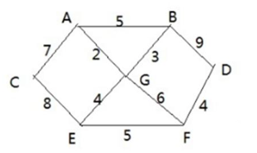

1. 乡里有7个村庄(A,B,C,D,E,F,G) ，现在需要修路把7个村庄连通

2. 各个村庄的距离用边线表示(权) ，比如 A - B 距离 5公里

   问:如何修路保证各个村庄都能连通，并且总的修建公路总里程最短?

**简单思路:** 将 10 条边，连接即可，但是总的里程数不是最小.

**正确的思路:** 尽可能的选择少的路线，并且每条路线最小，保证总里程数最少


##### 最小生成树

修路问题本质就是就是最小生成树问题， 先介绍一下**最小生成树(Minimum Cost Spanning Tree)**，简称MST

给定一个带权的无向连通图,如何选取一棵生成树，使树上所有边上权的总和为最小这叫最小生成树

1. N个顶点，一定有N-1条边
2. 包含全部顶点
3. N-1条边都在图中


##### [代码实现](src/main/java/com/tzuxin/algorithm/prim/PrimAlgorithm.java)

```java
/**
 * Prim算法，得到最小生成树
 * @param graph 图
 * @param v 从那个顶点开始生成
 */
public void prim(Graph graph, int v) {
    // 标记节点是否访问过 0是没访问过 1是访问过
    int[] isVisited = new int[graph.getVerxs()];

    // 标记为已访问
    isVisited[v] = 1;
    // 用来标记顶点下标
    int h1 = -1;
    int h2 = -1;
    // 用来对比权值的值
    int minWeight = Integer.MAX_VALUE;

    // 需要n-1条边
    for (int k = 1; k < graph.getVerxs(); k++) {

        // 确定每一次生成的子图(i节点)能到达的权值最小的没访问过的点(j)
        // i表示已经访问的节点，j表示没被访问过的节点
        for (int i = 0; i < graph.getVerxs(); i++) {
            for (int j = 0; j < graph.getVerxs(); j++) {
                if (isVisited[i] == 1 && isVisited[j] == 0 && graph.getWeight()[i][j] < minWeight) {
                    h1 = i;
                    h2 = j;
                    minWeight = graph.getWeight()[i][j];
                }
            }
        }
        // 输出此次找到的节点
        System.out.println("边->" + graph.getData()[h1] + "---" + graph.getData()[h2] + "，权值为" + graph.getWeight()[h1][h2]);
        // 重置参数
        isVisited[h2] = 1;
        minWeight = Integer.MAX_VALUE;
    }
}
```


### 4.7 克鲁思卡尔(Kruskal)算法

#### 算法解析

##### 算法图解

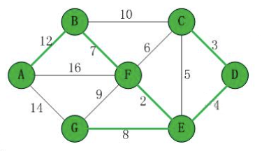

第 1步：将边**<E,F>**加入 R 中。边<E,F>的权值最小，因此将它加入到最小生成树结果 R 中。

第2步：将边**<C,D>**加入 R中。上一步操作之后，边<C,D>的权值最小，因此将它加入到最小生成树结果 R 中

第3步：将边**<D,E>**加入 R中。上一步操作之后，边<D,E>的权值最小，因此将它加入到最小生成树结果 R 中

第4步：将边**<B,F>**加入 R 中。上一步操作之后，边<C,E>的权值最小，但<C,E>会和已有的边构成回路:因此，跳过边<C,E>。同理，跳过边<C,F>。将边<B,F>加入到最小生成树结果 R 中。

第 5步：将边**<E.G>**加入 R 中。上一步操作之后，边<E,G>的权值最小，因此将它加入到最小生成树结果 R 中

第6步：将边**<A.B>**加入 R中。上一步操作之后，边<F,G>的权值最小，但<F.G>会和已有的边构成回路:因此，跳过边<F.G>。同理，跳过边<B,C>。将边<A,B>加入到最小生成树结果 R 中。

此时，最小生成树构造完成! 它包括的边依次是: **<E,F> <C,D> <D,E> <B,F> <E,G> <A,B>**


##### 解析

根据前面介绍的克鲁斯卡尔算法的基本思想和做法，我们能够了解到，克鲁斯卡尔算法重点需要解决的以下两个问题:

**问题一** 对图的所有边按照权值大小进行排序。

**问题二** 将边添加到最小生成树中时，怎么样判断是否形成了回路。

问题一很好解决，采用排序算法进行排序即可。问题二，处理方式是:记录顶点在"最小生成树"中的终点，顶点的终点是"在最小生成树中与它连通的最大顶点"然后每次需要将一条边添加到最小生存树时，判断该边的两个顶点的终点是否重合，重合的话则会构成回路。


##### 判断是否构成回路

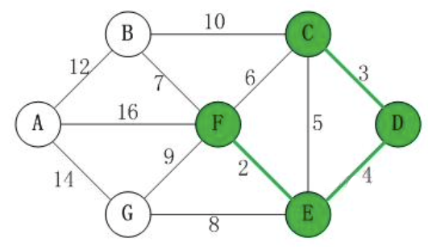

在将<E,F><C,D> <D,E>加入到最小生成树 R 中之后，这几条边的顶点就都有了终点:

- C 的终点是 F
- D 的终点是 F。
- E 的终点是 F
- F的终点是 F

关于终点的说明:

1. 就是将所有顶点按照从小到大的顺序排列好之后，某个顶点的终点就是**"与它连通的最大顶点"**。
2. 因此，接下来，虽然**<C,E>**是权值最小的边。但是 C和E的终点都是F，即它们的终点相同，因此，将<C,E>加入最小生成树的话，会形成回路。这就是判断回路的方式。也就是说，我们加入的边的两个顶点不能都指向同-人终点，否则将构成回路。


#### 应用场景-最小生成树

[代码实现](src/main/java/com/tzuxin/algorithm/kruskal/KruskalAlgorithm.java)

```java
// 部分代码

/**
 * 克鲁斯卡尔算法
 */
public void kruskal() {
    // 表示最后数组结果的索引
    int index = 0;
    // 存放最小生成树中节点的终点
    int[] ends = new int[edgeNum];
    // 记录最后的结果,边的数量=节点-1
    Edge[] rest = new Edge[vertexes.length-1];

    // 获取所有边的集合
    Edge[] edges = getEdgesList();

    // 遍历所有的边，判断是否会形成回路，不会的就加入到rest数组中
    for (Edge edge : edges) {
        // 查询这条边两个顶点的下标
        int p1 = getPosition(edge.getStart());
        int p2 = getPosition(edge.getEnd());
        // 找到这两个点的终点
        int m = getEnd(ends, p1);
        int n = getEnd(ends, p2);
        // 如果没有形成回路
        if (m != n) {
            // 记录m的终点为n
            ends[m] = n;
            // 把这条线加入结果数组中
            rest[index++] = edge;
        }
    }
    System.out.println("result: " + Arrays.toString(rest));
}


/**
 * 获取下标为i的顶点的重点，用于判断两个顶点的终点是否一直
 *
 * @param ends 各个顶点对应的终点
 * @param i    顶点的下标
 * @return 终点的下标
 */
public int getEnd(int[] ends, int i) {
    // 如果终点不是0，则一直寻找
    while (ends[i] != 0) {
        i = ends[i];
    }
    return i;
}
```


### 4.8 狄杰斯特拉(Dijkstra)算法

#### Dijkstra算法

##### 算法介绍

迪杰斯特拉(Diikstra)算法是**典型最短路径算法**，用于计算一个结点到其他结点的最短路径。它的主要特点是以起始点为中心向外层层扩展(**广度优先搜索思想**)，直到扩展到终点为止。


##### 算法过程

设置出发顶点为v，顶点集合 V{v1, v2, vi...}，v到V中各顶点的距离构成距离集合 Dis，Dis{d1, d2, di...}，Dis集合记录着v到图中各顶点的距离(到自身可以看作 0，v到vi距离对应为 di)，从 Dis 中选择值最小的di并移出 Dis 集合，同时移出V集合中对应的顶点 vi，此时的v到即为最短路径


#### 应用场景-最短路径问题

##### 问题

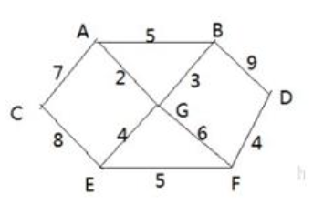

求一个点到其他点的最短路径。


##### [代码实现](src/main/java/com/tzuxin/algorithm/dijkstra/DijkstraAlgorithm.java)

```java
/**
 *
 * @param graph 图的实例
 * @param index 出发顶点对应的下标
 */
public void dijkstraAlgorithm(Graph graph, int index){
    this.graph = graph;
    vv = new VisitedVertex(graph.getVertexes().length, index);
    // 更新index节点到周围节点的前驱和最短距离
    update(index);
    for (int i = 1; i < this.graph.getVertexes().length; i++) {
        // 选择并返回新的访问节点(上一次遍历后路径最短的合适节点)
        index = vv.updateArr();
        update(index);
    }
}

/**
 * 更新index顶点到周围顶点的距离和周围顶点的前驱顶点
 * @param index 顶点下标
 */
private void update(int index){
    int len;
    for(int j = 0; j < this.graph.getMatrix()[index].length; j++) {
        // 获取最新的路径：起点到达该节点的最短路径 + 当前节点到达该节点的路径
        len = vv.getDisByIndex(index) + this.graph.getMatrix()[index][j];
        // 如果该节点还没更新过 且 拿到的路径小于已经存在的路径
        if(!vv.isAlready(j) && len < vv.getDisByIndex(j)) {
            // 更新父节点
            vv.updatePre(j, index);
            // 更新结果数组
            vv.updateDis(j, len);
        }
    }
}
```


### 4.9 弗洛伊德(Floyd)算法


#### 应用场景-最短路径

##### 代码实现

```java
/**
 * 弗洛伊德算法
 * @param graph 图
 */
public static void floyd(Graph graph) {
    //变量保存距离
    int len = 0;
    //对中间顶点遍历， k 就是中间顶点的下标 [A, B, C, D, E, F, G]
    for(int k = 0; k < graph.getDis().length; k++) {
        //从i顶点开始出发 [A, B, C, D, E, F, G]
        for(int i = 0; i < graph.getDis().length; i++) {
            //到达j顶点 // [A, B, C, D, E, F, G]
            for(int j = 0; j < graph.getDis().length; j++) {
                // => 求出从i 顶点出发，经过 k中间顶点，到达 j 顶点距离
                len = graph.getDis()[i][k] + graph.getDis()[k][j];
                //如果len小于 dis[i][j]
                if(len < graph.getDis()[i][j]) {
                    //更新距离
                    graph.getDis()[i][j] = len;
                    //更新前驱顶点
                    graph.getPre()[i][j] = graph.getPre()[k][j];
                }
            }
        }
    }
}
```

### 4.10 马踏棋盘算法


#### 马踏棋盘算法介绍

1. 马踏棋盘算法也被称为骑士周游问题
2. 将马随机放在国际象棋的 8X8 棋盘 Board\[0~7]\[0~7]的某个方格中，马按走棋规则(马走日字)进行移动。要求每个方格只进入一次，走遍棋盘上全部 64 个方格


#### 代码实现

1. 马踏棋盘问题(骑士周游问题)实际上是图的深度优先搜索(DFS)的应用。
2. 如果使用回溯(就是深度优先搜索)来解决，假如马儿踏了 53 个点，如图:走到了第 53 个，坐标 (1,0)，发现已经走到尽头，没办法，那就只能回退了，查看其他的路径，就在棋盘上不停的回溯····
3. 分析第一种方式的问题，并使用贪心算法（greedy algorithm）进行优化。

```java
// 部分代码


/**
 * 完成骑士周游问题的算法
 * @param chessboard 棋盘
 * @param row 马儿当前的位置的行 从0开始
 * @param column 马儿当前的位置的列  从0开始
 * @param step 是第几步 ,初始位置就是第1步
 */
public static void traversalChessboard(int[][] chessboard, int row, int column, int step) {
    chessboard[row][column] = step;
    //标记该位置已经访问
    isVisited[row][column] = true;
    //获取当前位置可以走的下一个位置的集合
    ArrayList<Point> ps = next(new Point(column, row));
    //对ps进行排序,排序的规则就是对ps的所有的Point对象的下一步的位置的数目，进行非递减排序
    sort(ps);
    //遍历 ps
    while(!ps.isEmpty()) {
        //取出下一个可以走的位置
        Point p = ps.remove(0);
        //判断该点是否已经访问过
        if(!isVisited[p.y][p.x]) {
            //说明还没有访问过
            traversalChessboard(chessboard, p.y, p.x, step + 1);
        }
    }
    //判断马儿是否完成了任务，使用   step 和应该走的步数比较 ，
    //如果没有达到数量，则表示没有完成任务，将整个棋盘置0
    //说明: step < X * Y  成立的情况有两种
    //1. 棋盘到目前位置,仍然没有走完
    //2. 棋盘处于一个回溯过程
    if(step < X * Y && !finished ) {
        chessboard[row][column] = 0;
        isVisited[row][column] = false;
    } else {
        finished = true;
    }
}

```

